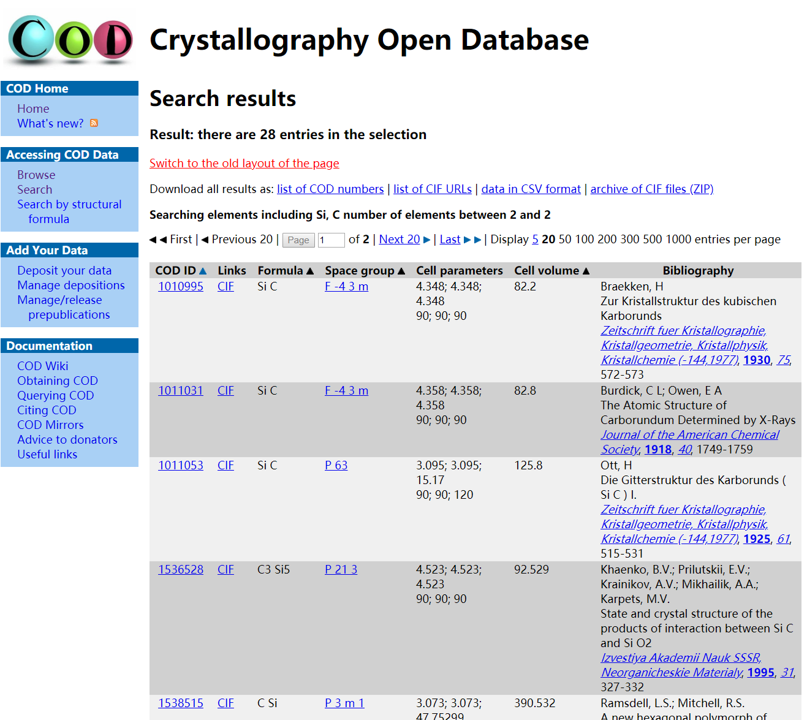

* TOC
{:toc}

# QE实践——计算半导体SiC的能带

计算分为三个步骤：1. 优化晶格常数；2. 自洽计算；3. 能带计算。

碳化硅SiC有多种结构，这里作为示范，选择了比较简单的闪锌矿(Zincblende)结构，也记做(β)3C-SiC。

计算需要知道SiC的原胞尺寸、原子坐标和晶格常数，这些参数是从实验得到的，除了从文献获取外，这里推荐一个数据库[Crystallography Open Database](http://www.crystallography.net/cod/)（COD）。

打开COD主页，点击左侧的"search"。

    

在搜索页面“1 to 8 elements”一栏输入Si和C，“number of distinct elements min and max”一栏输入2和2，表示搜索Si和C元素组成的二元化合物，点击“send”开始搜索。搜索的结果包含了数据库中的SiC二元化合物的多种组分及结构，其中有两个空间群为F-43m是我们要找的闪锌矿结构，晶格常数略有不同，分别是4.348和4.358，选择自己喜欢的一个，考虑到后面要计算晶格常数的理论值，这里的选择没有什么影响。

    

pw.x的初始晶体结构及晶格参数是实验值，但是，为了后续可能的超胞计算需要通过力的弛豫（relax）得到理论值（如果只计算体材料能带，用实验值也未尝不可）。

# Reference

1. http://www.quantum-espresso.org/resources/faq

